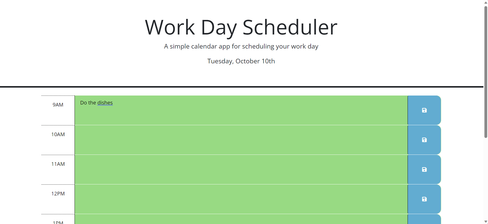

## Workday Scheduler

# Description

This scheduler presents users with time blocks based on real-time availability, allowing them to insert and save tasks. It serves as an efficient tool to manage and track to-do lists, ensuring tasks and assignments remain at the forefront of one's mind when referring back to the scheduler.

# Screenshot

[Link to website](https://vincula1.github.io/workdaysched/)
